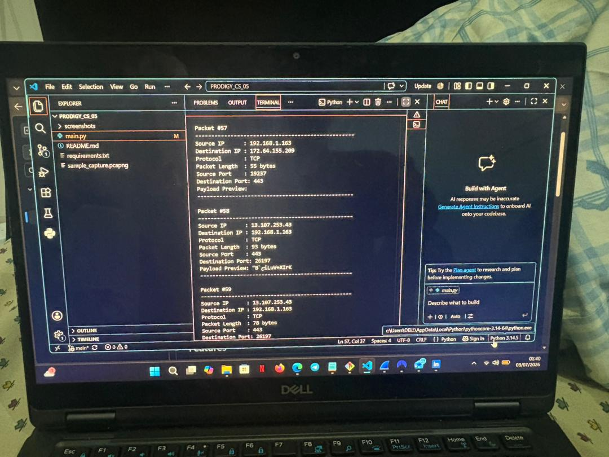
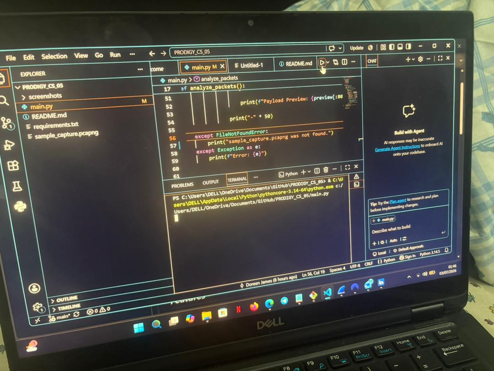
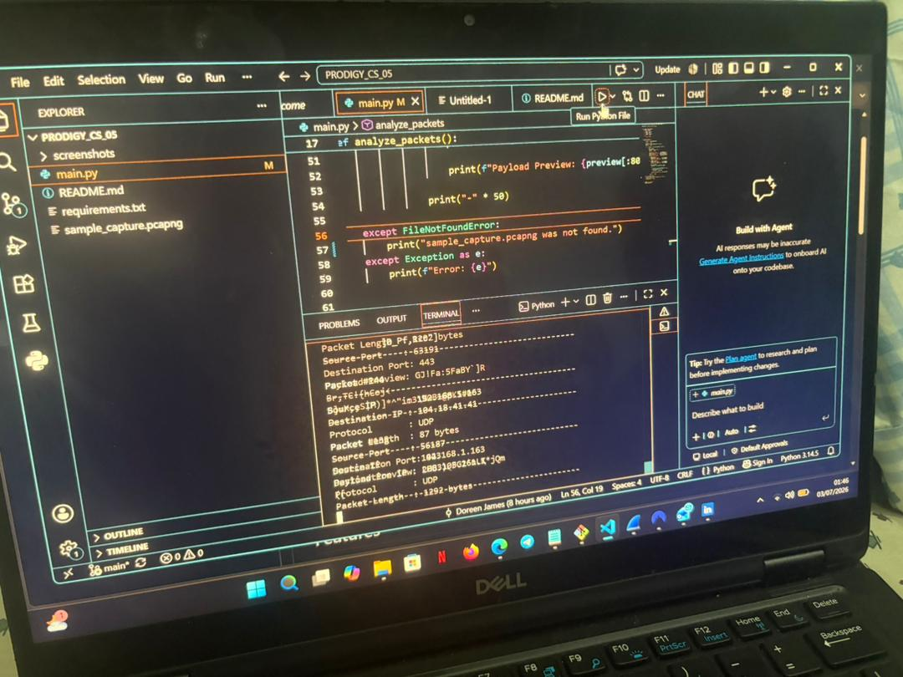
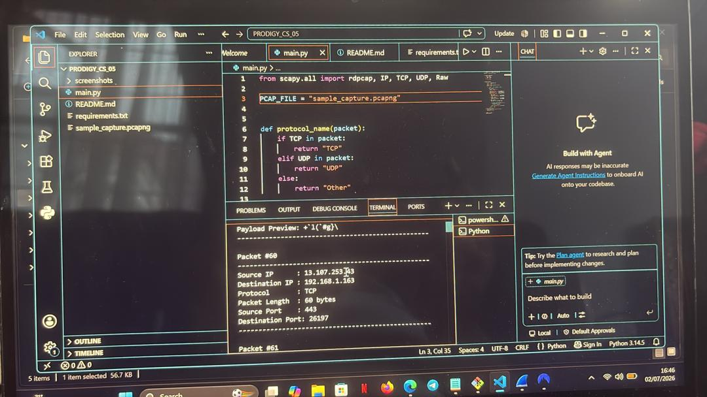

# PRODIGY_CS_05

# Network Packet Analyzer

## Description

This project is a Python-based Network Packet Analyzer developed as part of the Prodigy InfoTech Cybersecurity Internship.

The application reads packets from a captured **.pcapng** file using the Scapy library and extracts useful network information such as source and destination IP addresses, protocols, packet length, ports, and payload previews.

## Features

- Analyze packets from a PCAP/PCAPNG capture file
- Display source and destination IP addresses
- Identify TCP, UDP, and ICMP protocols
- Display packet length
- Display source and destination ports
- Preview packet payload data
- Simple command-line interface

## Technologies Used

- Python 3
- Scapy

## Installation

Install Scapy:

```bash
pip install scapy
```

## Usage

Run the program:

```bash
python main.py
```

Ensure that the packet capture file (`sample_capture.pcapng`) is located in the project directory before running the application.

## Sample Output

The analyzer displays:

- Source IP Address
- Destination IP Address
- Network Protocol
- Packet Length
- Source Port
- Destination Port
- Payload Preview

## Project Structure

```
PRODIGY_CS_05/
│── main.py
│── sample_capture.pcapng
│── requirements.txt
│── README.md
└── screenshots/
```
## Screenshots

### Packet Analysis Output


### Running the Program


### Source Code


### Additional Packet Analysis


## Author

Doreen James
